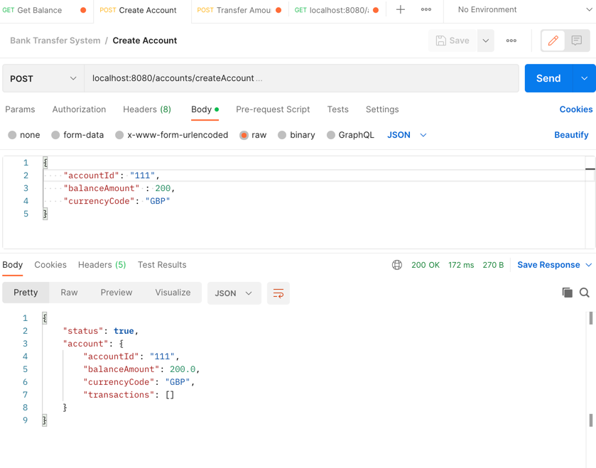
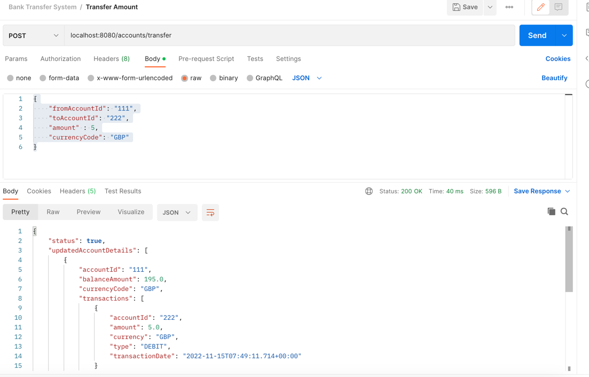
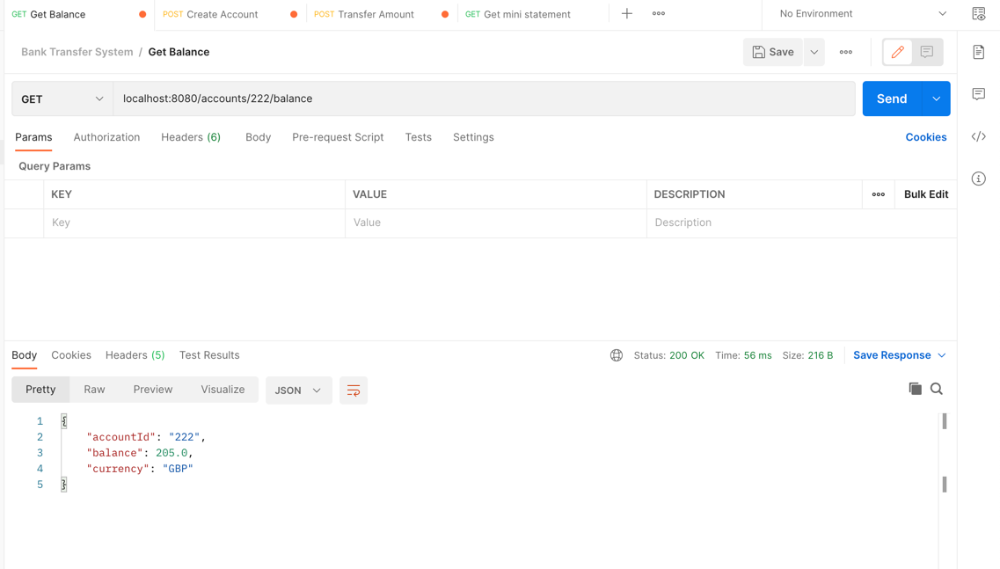
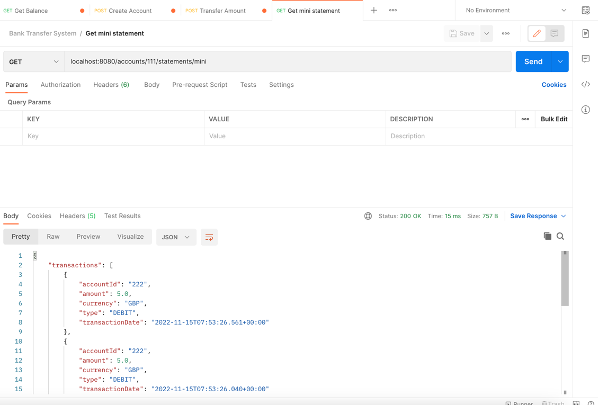

# intra-bank-transfer-system-v1
## Description

intra-bank payment transfer system to allow real time payments between internal accounts.

This service is
* Accessible by Restful Webservices
* able to tell account balance in real time
* able to get mini statement for last 20 transactions
* able to transfer money in real time
* able to fetch accounts details from accounts service

## APIs and Workflow
### 1. Create an account
* To create an account , user can make a POST api call to "/createAccount" rest webservice.
* Sample URL : http://localhost:8080/accounts/createAccount
* Sample Request Json : 
{
  "accountId": "111",
  "balanceAmount" : 200,
  "currencyCode": "GBP"
  }

### 2. Transfer amount
* To transfer amount between accounts, user can make a POST api call to "/accounts/transfer"
* Sample URL : http://localhost:8080/accounts/transfer
* Sample Request Json :
  {
  "fromAccountId": "111",
  "toAccountId": "222",
  "amount" : 5,
  "currencyCode": "GBP"
  }

### 3. Balance inquiry
* To get the balance of an account, user can make a GET api call to "/accounts/222/balance".
* Sample URL : http://localhost:8080/accounts/222/balance

### 4. Mini Statement
* To get the mini statement, user can make a GET api call to "/accounts/111/statements/mini"
* Sample URL : http://localhost:8080/accounts/111/statements/mini

